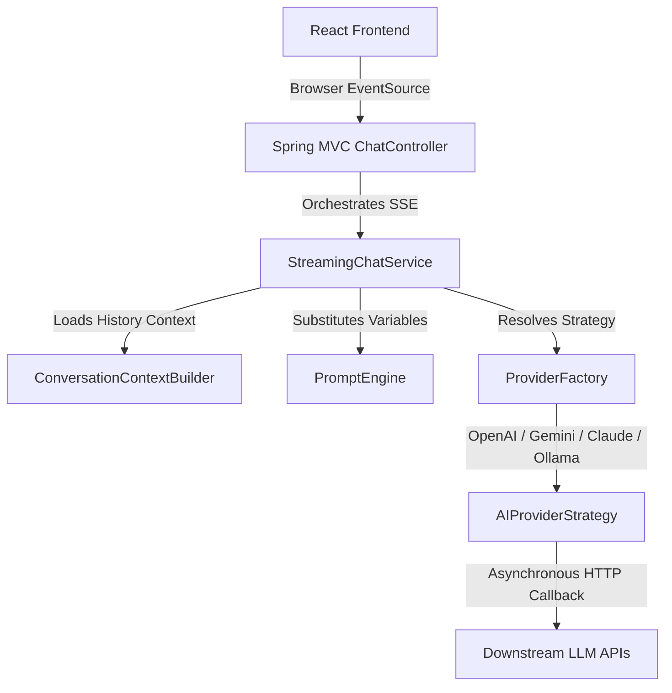

# ⚡ VivekAI Studio

[](https://www.oracle.com/java/)
[](https://spring.io/projects/spring-boot)
[](https://www.postgresql.org/)
[](https://vitejs.dev/)
[](https://react.dev/)
[](https://www.docker.com/)

A feature-rich, production-ready AI Multi-Provider Workspace and template orchestration platform. **VivekAI Studio** acts as a unified developer sandbox where you can manage API credentials, configure and version reusable prompt templates, organize conversations into workspace trees, and stream real-time model completions from multiple providers.

---

## 🏗️ System Architecture

The application is built using a decoupled architecture, leveraging the **Strategy Pattern** on the backend to dynamically switch downstream AI providers at runtime, and a **Context-driven State System** on the React frontend.



---

## 🛠️ Technology Stack

| Component | Technology | Role / Usage |
| :--- | :--- | :--- |
| **Backend Core** | Java 21 / Spring Boot 3.3 | REST APIs, business orchestration, and strategy resolution |
| **Security** | Spring Security & Stateless JWT | Stateless authentication, bearer token verification, and endpoint authorization |
| **Persistence** | PostgreSQL 16 / Hibernate / JPA | Database engine, entity relationship mapping, and metrics tracking |
| **Migrations** | Flyway DB | Versioned schema migration files (`V1` to `V17`) |
| **Frontend UI** | React 18 / JavaScript (JSX) | Responsive dashboard interface |
| **Styling** | Vanilla CSS / Tailwind CSS | Glassmorphic dark-mode workspace shell |
| **Markdown** | React Markdown / Prism Highlighter | Streamed markdown rendering and syntax highlighting for code blocks |

---

## 🗄️ Database Mappings & Migrations

The platform maintains a relational schema managed across **17 versioned Flyway migrations**:

*   `users` / `roles`: Manages credentials, account states, and authorization scopes.
*   `workspaces` / `folders`: Organizes conversation threads hierarchically.
*   `conversations`: Tracks active threads referencing specific `prompt_profile_versions`.
*   `messages`: Log role (`USER`, `ASSISTANT`), content Markdown, token usage metrics, latency, and error states.
*   `prompt_categories`: Categorizes templates (e.g., `DEVELOPMENT`, `MARKETING`, `EDUCATION`).
*   `prompt_profiles` / `prompt_profile_versions`: Decouples profile metadata from versioned system prompts, temperature, and tokens.
*   `prompt_variables`: Stores dynamic templates variable definitions (`STRING`, `BOOLEAN`, etc.) and default values.

---

## 🔌 API Endpoints Reference

### 🔐 Authentication (`/api/v1/auth`)

| Method | Endpoint | Description | Request Body |
| :--- | :--- | :--- | :--- |
| `POST` | `/api/v1/auth/register` | Registers a new user | `UserRegistrationRequest` (username, email, password) |
| `POST` | `/api/v1/auth/login` | Authenticates and returns JWT | `UserLoginRequest` (username, password) |
| `GET` | `/api/v1/auth/me` | Gets authenticated session details | *None (Requires Bearer Token)* |

### 📁 Workspaces & Folders (`/api/v1/workspaces`)

| Method | Endpoint | Description |
| :--- | :--- | :--- |
| `GET` | `/api/v1/workspaces` | Lists workspaces owned by the user |
| `POST` | `/api/v1/workspaces` | Creates a new workspace |
| `POST` | `/api/v1/workspaces/{id}/folders` | Creates a folder inside a workspace |
| `GET` | `/api/v1/workspaces/{id}/folders` | Lists folders inside a workspace |

### 💬 Conversations (`/api/v1/conversations`)

| Method | Endpoint | Description |
| :--- | :--- | :--- |
| `GET` | `/api/v1/conversations/workspace/{workspaceId}` | Fetches active chats list |
| `GET` | `/api/v1/conversations/{id}/messages` | Fetches chronological message history |
| `PATCH` | `/api/v1/conversations/{id}/pin` | Pins / unpins a conversation thread |
| `PATCH` | `/api/v1/conversations/{id}/favorite` | Favorites / unfavorites a conversation thread |
| `DELETE` | `/api/v1/conversations/{id}` | Performs a soft-delete marking on the thread |

### 🚀 AI Completions & Streaming (`/api/v1/chat`)

| Method | Endpoint | Description | Query Parameters / Payload |
| :--- | :--- | :--- | :--- |
| `POST` | `/api/v1/chat/{workspaceId}/send` | Executes standard blocking chat request | `ChatRequest` (prompt, model, settings) |
| `GET` | `/api/v1/chat/{workspaceId}/stream` | Streams token completions via SSE | `prompt`, `providerCode`, `modelName`, `promptProfileId` |

---

## ⚙️ Local Development Setup

Follow these steps to get the full stack running on your machine:

### 1. Environment Configurations
Copy the environment template from the root folder to `.env`:
```bash
cp .env.example .env
```
Open `.env` and fill in your local configurations:
*   **`DB_USER`** and **`DB_PASSWORD`**: Set your PostgreSQL superuser credentials.
*   **`JWT_SECRET`**: Set a secure signing secret (at least 256-bits).
*   **`OPENAI_API_KEY` / `GEMINI_API_KEY`**: Set your keys to use remote providers (falls back to simulated mock streams if omitted).

### 2. Start PostgreSQL (via Docker Compose)
If you have Docker Desktop installed, spin up the database and pgAdmin containers:
```bash
docker compose up -d
```
> [!NOTE]
> If you are running PostgreSQL natively on your Windows host instead of Docker, make sure the service is running on port `5432` and that the credentials in `.env` match your local service configurations.

### 3. Start Backend REST Server
From the project root directory, run the Maven command to start Spring Boot:
```bash
cd backend
mvn spring-boot:run
```
The Maven build is configured to automatically load the `.env` file using the `properties-maven-plugin` and run the server at `http://localhost:8080/api`.

### 4. Start Frontend client
Install node packages and launch the Vite development server:
```bash
cd frontend
npm install
npm run dev
```
Open [http://localhost:3000](http://localhost:3000) to access the VivekAI Studio interface.

---

## 🔁 CI/CD Pipelines

The repository contains separate CI configurations to ensure seamless build and test validation across both platforms:

### 🐙 GitHub Actions
*   **Workflow File**: [.github/workflows/ci.yml](file:///.github/workflows/ci.yml)
*   **Trigger**: Runs automatically on every push or pull request to the `main` branch.
*   **Jobs**:
    *   `backend-test`: Sets up JDK 21, boots up a PostgreSQL 16 service container, runs Flyway database migrations, and executes the backend test suite with a test JWT key.
    *   `frontend-test`: Sets up Node.js 20, installs dependencies, and runs the production build.

### 🦊 GitLab CI/CD
*   **Workflow File**: [.gitlab-ci.yml](file:///.gitlab-ci.yml)
*   **Trigger**: Runs automatically on every push to the GitLab repository.
*   **Jobs**:
    *   `backend-test`: Replicates the backend testing stage using a `maven:3.9.6-eclipse-temurin-21` container, PostgreSQL service, and project-level Maven dependency caching.
    *   `frontend-test`: Runs the frontend validation steps using a `node:20` image with package caching.

---

## 🎨 UI Showcase

The workspace dashboard features:
1.  **Sidebar Workspace Trees**: Pinned and favorited conversations reside at the top of the sidebar. Folders can be expanded to organize active chats.
2.  **Dynamic Variable Parser**: Choosing a Prompt Profile parses variable definitions (`{{variableName}}`) in system prompts and displays custom forms to fill inputs dynamically.
3.  **Real-Time Token Stream**: Text tokens render on-the-fly using responsive Markdown renderers with complete syntax highlighting for markdown tables, formulas, and code block formatting.